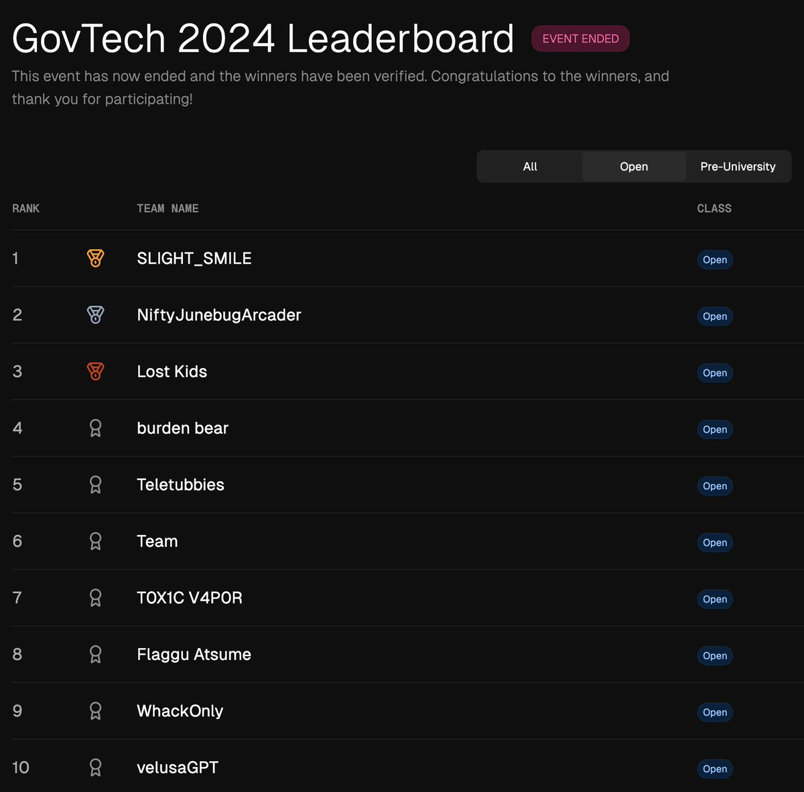

# GovTech CTF Writeup

This Jupyter Book contains Team Team's writeup for both events of the [2024 Singapore AI CTF](https://www.tech.gov.sg/media/events/singapore-ai-ctf-2024/) that was organized by [GovTech](https://www.tech.gov.sg/about-us/who-we-are/) and [dreadnode ☠️](https://www.dreadnode.io/).

We finished **6th** (open category and overall) in the qualifying round:


 and **3rd** (open category) in the final:

We thank **dreadnode** and **GovTech** for organizing one of the most fun AI/ML CTF events in recent memory, and for not bringing back the CIFAR challenge.

```{tableofcontents}
```
