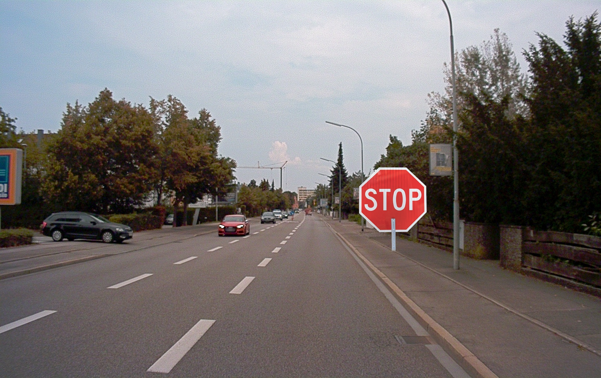
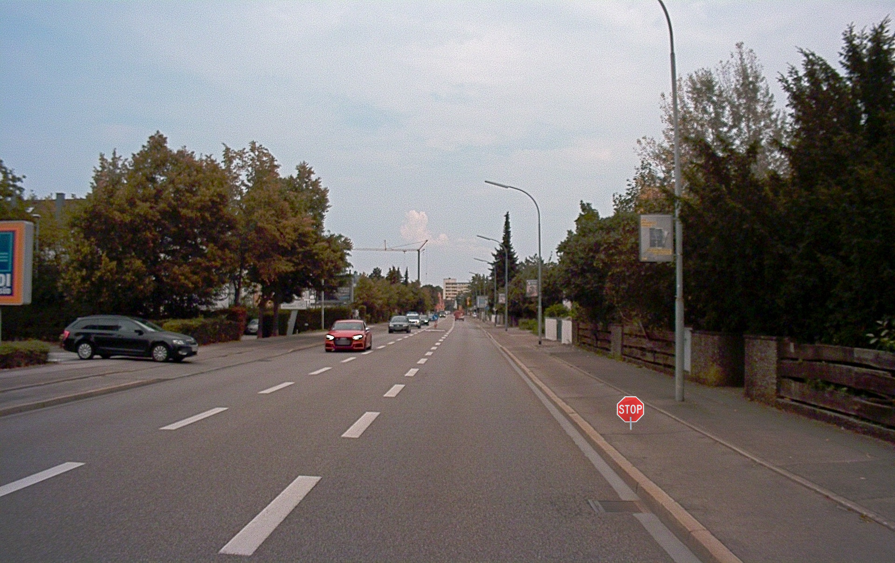

# Autopilot 1 and 2
##Autopilot 1:
Seeing as the challenge descriptions were relatively simple (Make the model detect a stop sign.), we decided to simply photoshop a stop sign onto the image:

Looking at the second challenge description, we noticed that we simply had to change less of the image. Thus, we decided to shrink the stop sign:

solving both challenges.